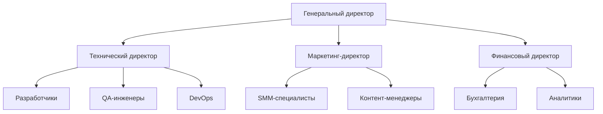
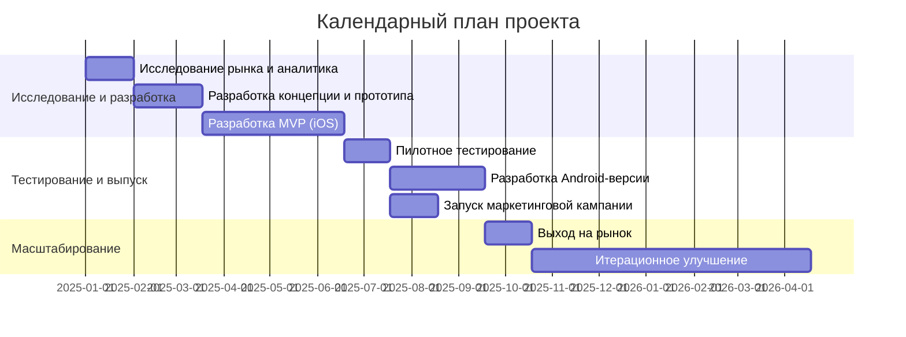
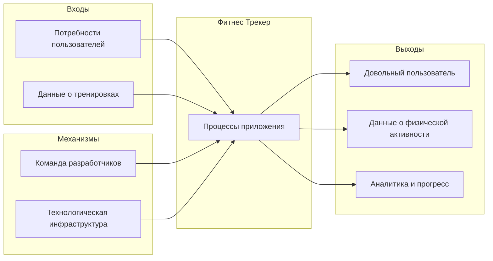

# Проектная работа "Фитнес Трекер"

## Содержание

- [1. Резюме проекта](#1-резюме-проекта)
- [2. Формулировка миссии компании](#2-формулировка-миссии-компании)
- [3. Концепция и технология проекта](#3-концепция-и-технология-проекта)
- [4. Бизнес-модель проекта](#4-бизнес-модель-проекта)
- [5. Формулировка целей и оценка жизнеспособности](#5-формулировка-целей-и-оценка-жизнеспособности)
- [6. Корпоративное Интернет-представительство](#6-корпоративное-интернет-представительство)
- [7. Организационно-финансовая схема](#7-организационно-финансовая-схема)
- [8. Организационные, производственные и финансовые параметры](#8-организационные-производственные-и-финансовые-параметры)
- [9. Моделирование бизнес-процессов](#9-моделирование-бизнес-процессов)
- [10. PEST-анализ](#10-pest-анализ)
- [11. SWOT-анализ](#11-swot-анализ)

## 1. Резюме проекта

Фитнес Трекер — многофункциональное мобильное приложение для отслеживания физической активности, рассчитанное на широкую аудиторию любителей спорта и активного образа жизни. Приложение предназначено для комплексного мониторинга различных видов тренировок, включая бег, велосипед, плавание и другие виды физической активности.

Рынок фитнес-приложений активно развивается и, по данным аналитиков, достигнет объема в $14,7 млрд к 2026 году с ежегодным ростом в 23%. Растущий интерес к здоровому образу жизни, особенно после пандемии COVID-19, создает благоприятные условия для запуска новых продуктов в этой нише.

Конкурентным преимуществом нашего Фитнес Трекера является комбинация точного отслеживания различных параметров тренировок, удобного интерфейса и социальных функций при сохранении доступной цены. В отличие от существующих решений, наше приложение фокусируется на детальном анализе сердечного ритма и персонализированных рекомендациях, что выделяет его среди конкурентов.

## 2. Формулировка миссии компании

### Суть бренда
Точные данные для осмысленных тренировок.

### Миссия бренда
Помогать людям достигать физических целей через осознанные тренировки, основанные на точной аналитике.

### История бренда
Фитнес Трекер родился из личного опыта команды разработчиков, столкнувшихся с ограничениями существующих решений при подготовке к марафону. Мы создали приложение, которое хотели бы использовать сами — с фокусом на детальной аналитике и удобстве использования.

### Содержание бренда
**Предложение пользователю:** Полный контроль над тренировочным процессом через точные данные и персонализированные рекомендации.

**Рациональные выгоды:**
- Точное отслеживание всех параметров тренировки
- Комплексный анализ сердечного ритма
- Визуализация прогресса
- Планирование тренировок

**Эмоциональные выгоды:**
- Уверенность в правильности тренировочного процесса
- Мотивация через отслеживание прогресса
- Чувство принадлежности к сообществу единомышленников
- Гордость за достижения

### Ключевые слова бренда
Точность, Прогресс, Аналитика, Осознанность, Движение, Здоровье, Сообщество

### Визуал бренда
Основные цвета: градиент от синего (#4e54c8) к фиолетовому (#8f94fb), белый, черный.
Логотип: Минималистичное изображение бегущего человека с элементами графика активности.
Шрифты: Roboto (основной), San Francisco (для iOS), Nunito (для заголовков).

## 3. Концепция и технология проекта

### Уникальность продукта

Фитнес Трекер выделяется среди конкурентов следующими особенностями:

1. **Детальный анализ сердечного ритма** — разбивка по зонам с рекомендациями для оптимизации тренировок
2. **Универсальность** — поддержка более 20 видов физической активности
3. **Интуитивно понятный интерфейс** — разработан с фокусом на удобство использования
4. **Социальные функции** — возможность делиться достижениями и соревноваться с друзьями
5. **Адаптация под разные устройства** — работа даже на устройствах с ограниченными ресурсами

### Технические характеристики

Приложение разрабатывается на следующих технологиях:
- Front-end: Swift для iOS, Kotlin для Android
- Back-end: Node.js, Express, MongoDB
- API интеграции: Google Maps API, Strava API, Apple HealthKit, Google Fit
- Облачный хостинг: AWS

### Функциональность

1. **Отслеживание тренировок**
   - Запись маршрута с GPS
   - Мониторинг скорости, темпа, расстояния, времени
   - Отслеживание сердечного ритма
   - Расчет калорий

2. **Аналитика**
   - История тренировок
   - Анализ прогресса
   - Сравнительные графики
   - Зоны сердечного ритма

3. **Социальные функции**
   - Создание профиля
   - Добавление друзей
   - Публикация достижений
   - Участие в вызовах

4. **Персонализация**
   - Настраиваемые цели
   - Индивидуальные планы тренировок
   - Адаптивные рекомендации

### Сравнение с конкурентами

| Функция | Фитнес Трекер | Strava | Nike Run Club | Garmin Connect |
|---------|---------------|--------|---------------|----------------|
| Кол-во видов активности | 20+ | 30+ | 5 | 20+ |
| Анализ сердечного ритма | Детальный | Базовый | Базовый | Детальный |
| Бесплатные функции | 80% | 40% | 90% | 30% |
| Социальные функции | ✓ | ✓ | ✓ | Ограниченные |
| Планы тренировок | ✓ | Платные | ✓ | Платные |
| Требования к устройству | Средние | Высокие | Средние | Высокие |

## 4. Бизнес-модель проекта

### Канва бизнес-модели

**Ключевые партнеры:**
- Производители спортивных товаров
- Фитнес-клубы и студии
- Организаторы спортивных мероприятий
- Медицинские учреждения
- Блогеры и инфлюенсеры в сфере спорта

**Ключевые активности:**
- Разработка и улучшение приложения
- Анализ данных о пользователях
- Маркетинг и привлечение новых пользователей
- Поддержка пользователей
- Интеграция с другими сервисами и устройствами

**Ключевые ресурсы:**
- Команда разработчиков
- Алгоритмы анализа данных
- Серверная инфраструктура
- База данных пользователей
- Интеллектуальная собственность

**Ценностное предложение:**
- Комплексный анализ тренировок и прогресса
- Точное отслеживание параметров физической активности
- Социальное взаимодействие с другими спортсменами
- Персонализированные рекомендации
- Интуитивно понятный интерфейс

**Взаимоотношения с клиентами:**
- Самообслуживание через приложение
- Автоматизированная поддержка
- Сообщество пользователей
- Персональные уведомления
- Обратная связь через социальные сети

**Каналы сбыта:**
- App Store и Google Play
- Веб-сайт приложения
- Социальные сети
- Партнерские программы
- Спортивные мероприятия

**Потребительские сегменты:**
- Любители бега
- Велосипедисты
- Пловцы
- Посетители фитнес-клубов
- Профессиональные спортсмены
- Тренеры

**Структура расходов:**
- Разработка и поддержка приложения
- Серверная инфраструктура
- Маркетинг и реклама
- Зарплаты сотрудникам
- Комиссии магазинов приложений

**Потоки доходов:**
- Freemium-модель (базовые функции бесплатно, расширенные — платно)
- Подписка на премиум-версию
- Разовые платежи за специальные функции
- Комиссия от партнерских программ
- Продажа аналитических данных (в анонимном виде)

### Стратегия роста

- **Начальная фаза (0-6 месяцев)**: Фокус на привлечении первых 10 000 пользователей через маркетинг в социальных сетях и партнерство с локальными фитнес-сообществами.
- **Фаза роста (6-18 месяцев)**: Масштабирование до 100 000 пользователей, расширение функциональности, введение премиум-подписки.
- **Фаза зрелости (18+ месяцев)**: Достижение 1 000 000+ пользователей, интеграция с экосистемами здоровья, развитие дополнительных источников дохода.

## 5. Формулировка целей и оценка жизнеспособности

### Потребности клиентов
Приложение удовлетворяет следующие потребности:
- Отслеживание физической активности и прогресса
- Анализ эффективности тренировок
- Социальное взаимодействие в спортивном сообществе
- Получение рекомендаций для улучшения результатов
- Визуализация достижений

### Рыночная ниша
Фитнес Трекер нацелен на сегмент приложений для активного образа жизни с фокусом на пользователей, заинтересованных в детальной аналитике своих тренировок.

### Емкость сегмента и доля рынка
- Общий объем рынка фитнес-приложений: $5,1 млрд (2022)
- Ежегодный рост: 23%
- Целевой сегмент (аналитические фитнес-приложения): $1,2 млрд
- Планируемая доля рынка через 3 года: 2,5% ($30 млн)

### Объем продаж и целевая аудитория
- Целевое количество установок в первый год: 500 000
- Конверсия в платящих пользователей: 5%
- Средний доход с платящего пользователя: $3,99/месяц
- Годовой доход при достижении целей: $1,2 млн

### Привлечение и удержание пользователей
Для формирования начальной аудитории:
- Контент-маркетинг в спортивных сообществах
- Партнерство с фитнес-блогерами
- Реклама в социальных сетях
- ASO (App Store Optimization)
- Участие в спортивных мероприятиях

Для удержания аудитории:
- Регулярные обновления функционала
- Программа лояльности
- Геймификация (достижения, вызовы)
- Интеграция с социальными сетями
- Персонализированные уведомления

### Конкурентные преимущества
1. Более детальный анализ сердечного ритма
2. Доступность большинства функций в бесплатной версии
3. Оптимизированная работа на устройствах с ограниченными ресурсами
4. Интуитивно понятный интерфейс
5. Инновационные социальные функции

### Финансовые показатели
- Первоначальные инвестиции: $250 000
- Точка безубыточности: 18 месяцев
- ROI через 3 года: 280%
- Средняя стоимость привлечения пользователя: $1,20
- Средняя стоимость привлечения платящего пользователя: $24

## 6. Корпоративное Интернет-представительство

### Задачи корпоративного сайта

| Задачи | Свойства/функции сайта |
|--------|-------------------------|
| Продвижение приложения | Лендинг с описанием ключевых функций, скриншотами и демонстрационными видео |
| Информирование о новых функциях | Регулярно обновляемый блог с описанием обновлений и новых возможностей |
| Поддержка пользователей | База знаний, FAQ, форма обратной связи |
| Привлечение новых пользователей | SEO-оптимизированный контент, истории успеха пользователей |
| Сбор аналитики | Встроенные инструменты аналитики для отслеживания поведения посетителей |
| Формирование сообщества | Форум для пользователей, обсуждение тренировок, обмен опытом |
| Привлечение инвесторов | Раздел для инвесторов с финансовыми показателями и стратегией развития |
| Рекрутинг | Раздел карьеры с описанием открытых вакансий и корпоративной культуры |
| Интеграция с партнерами | API-документация для партнеров, программа для разработчиков |

## 7. Организационно-финансовая схема

### Организационная структура



### Взаимодействие участников бизнеса

Ключевыми участниками бизнеса являются:

1. Компания-разработчик (юридическое лицо) - отвечает за разработку, поддержку и развитие приложения Фитнес Трекер
2. Конечные пользователи - любители спорта и активного образа жизни, использующие приложение для отслеживания тренировок
3. Партнеры:
   - Производители спортивных товаров
   - Фитнес-клубы и студии
   - Организаторы спортивных мероприятий
   - Блогеры и инфлюенсеры в сфере спорта

Схема взаимодействия участников бизнеса:

```
                         +---------------------+
                         |                     |
                         |Компания-разработчик |
                         |                     |
                         +----------+----------+
                                  / | \
                                /   |   \
                              /     |     \
       +-------------------+/       |       \+----------------+
       |                   |        |        |                |
       | Конечные          |        |        | Партнеры       |
       | пользователи      |        |        |                |
       |                   |        |        | - Производители|
       | - Любители бега   |        |        |   спорттоваров |
       | - Велосипедисты   |        |        | - Фитнес-клубы |
       | - Пловцы          |        |        | - Организаторы |
       | - Посетители      |        |        |   мероприятий  |
       |   фитнес-клубов   |        |        | - Блогеры и    |
       |                   |        |        |   инфлюенсеры  |
       +-------------------+        |        +----------------+
            /|\                     |
             |                      |
       +-----+----------------------+------+
       |                                   |
       | Процессы взаимодействия:          |
       |                                   |
       | 1. Распространение через App Store|
       |    и Google Play                  |
       | 2. API-интеграция с партнерами    |
       | 3. Сбор обратной связи            |
       | 4. Совместные акции с партнерами  |
       |                                   |
       +-----------------------------------+
```

## 8. Организационные, производственные и финансовые параметры проекта

### Календарный план выполнения работ по проекту



### Ресурсы для реализации проекта

**Человеческие ресурсы:**
- Команда разработки: 5 человек (2 iOS-разработчика, 2 Android-разработчика, 1 backend-разработчик)
- Дизайнер UX/UI: 1 человек
- QA-инженер: 1 человек
- Маркетолог: 1 человек
- Продуктовый менеджер: 1 человек
- Технический директор: 1 человек

**Оборудование и программное обеспечение:**
- Компьютеры для разработки и тестирования
- Лицензии на ПО для разработки
- Серверная инфраструктура (облачные решения AWS)
- Тестовые устройства различных производителей

**Финансовые параметры:**
- Первоначальные инвестиции: 3 650 000 руб.
- Ежемесячные операционные расходы: 700 000 руб.
- Точка безубыточности: 18 месяцев после запуска
- Прогнозируемый ROI через 3 года: 280%

## 9. Моделирование бизнес-процессов

### 9.1. Схема функциональной модели верхнего уровня



### 9.2. Схема декомпозиции главного блока на бизнес-процессы основной деятельности

1. Регистрация и авторизация пользователя
2. Отслеживание тренировок
3. Визуализация маршрутов
4. Анализ сердечного ритма
5. Ведение истории тренировок
6. Формирование статистики (ежедневной, годовой)
7. Социальные взаимодействия

### 9.3. Декомпозиция главного бизнес-процесса с помощью USE CASE

**USER STORY**: Как пользователь Фитнес Трекера, я хочу начать новую тренировку, чтобы отслеживать свою физическую активность и анализировать результаты.

**Действующие лица**: Пользователь приложения

**Предварительные условия:**
1. Пользователь зарегистрирован в приложении
2. Пользователь авторизован в приложении
3. На устройстве пользователя включена геолокация
4. У пользователя достаточный заряд батареи для отслеживания тренировки

**Успешный сценарий:**
1. Пользователь открывает приложение
2. Нажимает кнопку "Начать тренировку" на главном экране
3. Выбирает тип тренировки (бег, велосипед, плавание и т.д.)
4. Приложение определяет местоположение пользователя
5. Пользователь нажимает кнопку "Старт"
6. Приложение начинает отслеживать данные тренировки (местоположение, скорость, пульс, время)
7. Пользователь выполняет тренировку
8. По завершении тренировки пользователь нажимает кнопку "Завершить"
9. Приложение показывает сводку тренировки (дистанция, время, средняя скорость, сожженные калории)
10. Пользователь сохраняет тренировку
11. Данные добавляются в историю тренировок и учитываются в статистике

**Альтернативные пути:**
1. Если геолокация не включена:
   - Приложение предлагает включить геолокацию
   - Пользователь включает геолокацию и продолжает
   - Или выбирает тип тренировки, не требующий геолокации

2. Если заряд батареи критически низкий:
   - Приложение предупреждает пользователя о риске потери данных
   - Предлагает включить энергосберегающий режим отслеживания
   - Пользователь решает продолжить или отложить тренировку

3. Если пользователь хочет приостановить тренировку:
   - Пользователь нажимает кнопку "Пауза"
   - Приложение прекращает активный сбор данных
   - Пользователь может продолжить тренировку, нажав "Продолжить", или завершить её

## 10. PEST-анализ

### Политические факторы (P)
- **Государственные программы поддержки здорового образа жизни** (+) — положительное влияние на популяризацию фитнеса и спорта
- **Регулирование персональных данных** (−) — необходимость соответствия требованиям законодательства разных стран (GDPR, 152-ФЗ)
- **Законодательство в сфере цифровой медицины** (−) — возможные ограничения для приложений, дающих рекомендации по здоровью
- **Политическая напряженность между странами** (−) — риски для международного масштабирования приложения

### Экономические факторы (E)
- **Рост рынка фитнес-приложений** (+) — прогнозируемый рост до $14,7 млрд к 2026 году
- **Повышение доходов целевой аудитории** (+) — увеличение числа потенциальных платящих пользователей
- **Колебания курсов валют** (−) — влияние на доходность проекта при международной монетизации
- **Экономические кризисы** (−) — риск сокращения расходов пользователей на платные подписки
- **Рост стоимости разработки ПО** (−) — увеличение операционных расходов

### Социально-культурные факторы (S)
- **Растущий интерес к здоровому образу жизни** (+) — увеличение потенциальной аудитории приложения
- **Последствия пандемии COVID-19** (+) — повышенное внимание к здоровью и физической активности
- **Тренд на персонализацию** (+) — потребность в индивидуальном подходе к тренировкам
- **Социальные сети и шеринг** (+) — желание пользователей делиться своими достижениями
- **Демографические изменения** (+) — расширение возрастного диапазона пользователей фитнес-приложений

### Технологические факторы (T)
- **Развитие носимых устройств** (+) — расширение возможностей для сбора данных о физической активности
- **Прогресс в области искусственного интеллекта** (+) — возможности для улучшения анализа данных и персонализации
- **Развитие мобильного интернета (5G)** (+) — повышение скорости и надежности передачи данных
- **Совершенствование датчиков в смартфонах** (+) — улучшение точности измерений без дополнительных устройств
- **Увеличение вычислительных мощностей мобильных устройств** (+) — возможность обработки большего объема данных

### Сводная таблица PEST-анализа

| Факторы | Влияние | Значимость |
|---------|---------|------------|
| **Политические** | | |
| Гос. программы поддержки ЗОЖ | Позитивное | Средняя |
| Регулирование персональных данных | Негативное | Высокая |
| Законодательство в цифровой медицине | Негативное | Средняя |
| Политическая напряженность | Негативное | Низкая |
| **Экономические** | | |
| Рост рынка фитнес-приложений | Позитивное | Высокая |
| Повышение доходов целевой аудитории | Позитивное | Средняя |
| Колебания курсов валют | Негативное | Средняя |
| Экономические кризисы | Негативное | Высокая |
| Рост стоимости разработки | Негативное | Средняя |
| **Социально-культурные** | | |
| Интерес к здоровому образу жизни | Позитивное | Высокая |
| Последствия пандемии COVID-19 | Позитивное | Средняя |
| Тренд на персонализацию | Позитивное | Высокая |
| Социальные сети и шеринг | Позитивное | Средняя |
| Демографические изменения | Позитивное | Низкая |
| **Технологические** | | |
| Развитие носимых устройств | Позитивное | Высокая |
| Прогресс в области ИИ | Позитивное | Высокая |
| Развитие мобильного интернета | Позитивное | Средняя |
| Совершенствование датчиков | Позитивное | Высокая |
| Рост вычислительных мощностей | Позитивное | Средняя |

## 11. SWOT-анализ

### Сильные стороны (Strengths)
- **Детальный анализ сердечного ритма** — более подробный, чем у большинства конкурентов
- **Универсальность** — поддержка различных видов физической активности
- **Интуитивно понятный интерфейс** — низкий порог входа для новых пользователей
- **Оптимизация для устройств с ограниченными ресурсами** — доступность для широкого круга пользователей
- **Высокая точность отслеживания параметров тренировок** — ценность для пользователей, ориентированных на результат

### Слабые стороны (Weaknesses)
- **Неоптимальное хранение данных** — технические проблемы, требующие рефакторинга
- **Избыточный вызов функций** — снижение производительности приложения
- **Ограниченные социальные функции** по сравнению с лидерами рынка
- **Отсутствие готовых планов тренировок** — необходимость самостоятельного планирования пользователем
- **Ограниченная интеграция с фитнес-устройствами** — меньше возможностей для пользователей с носимыми гаджетами

### Возможности (Opportunities)
- **Растущий рынок фитнес-приложений** — потенциал для привлечения новых пользователей
- **Интеграция искусственного интеллекта** — создание персонализированных рекомендаций
- **Расширение функциональности** — добавление планов тренировок и отслеживания дополнительных параметров
- **Партнерство с производителями спортивных товаров** — дополнительный канал монетизации
- **Выход на международный рынок** — увеличение пользовательской базы

### Угрозы (Threats)
- **Высокая конкуренция** — присутствие крупных игроков с большими ресурсами (Strava, Garmin, Apple)
- **Быстрое развитие технологий** — риск устаревания функционала
- **Изменение потребительских предпочтений** — переключение на другие способы отслеживания активности
- **Проблемы с конфиденциальностью данных** — потенциальные изменения в законодательстве
- **Экономический спад** — снижение платежеспособности целевой аудитории

### Матрица SWOT-анализа

| | Возможности | Угрозы |
|-|-------------|--------|
| **Сильные стороны** | 1. Использовать детальный анализ сердечного ритма для создания умных рекомендаций на базе ИИ<br>2. Выйти на новые рынки с акцентом на универсальность приложения<br>3. Привлекать новых пользователей за счет низкого порога входа и интуитивного интерфейса | 1. Подчеркивать преимущества в точности и детализации для конкуренции с крупными игроками<br>2. Поддерживать оптимизацию для устаревших устройств как уникальное преимущество<br>3. Развивать функционал в соответствии с изменяющимися технологиями |
| **Слабые стороны** | 1. Оптимизировать хранение данных для масштабирования<br>2. Разработать готовые планы тренировок для улучшения конкурентоспособности<br>3. Расширить интеграцию с фитнес-устройствами | 1. Улучшить производительность приложения для конкуренции с лидерами рынка<br>2. Внедрить дополнительные меры защиты данных<br>3. Разработать гибкие ценовые модели на случай экономического спада |